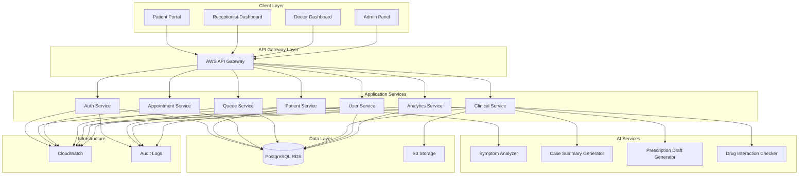
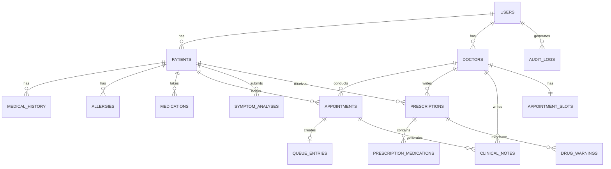

# Design Document: AI-Powered Hospital Management Portal

## Overview

The AI-Powered Hospital Management Portal is a cloud-native microservices architecture built on AWS infrastructure. The system consists of four primary user-facing applications (Patient Portal, Receptionist Dashboard, Doctor Dashboard, Admin Panel) supported by backend microservices and AI-powered services.

The architecture follows a distributed design pattern with:
- Frontend applications built with React/Next.js for responsive, modern user interfaces
- Backend microservices using Node.js and Python FastAPI for business logic
- AI services leveraging AWS SageMaker and custom NLP models
- PostgreSQL on AWS RDS for relational data storage
- AWS Cognito for authentication and authorization
- API Gateway for unified API management and routing

The system is designed to achieve 99% uptime, sub-2-second response times, and support 1000+ concurrent users through horizontal scaling and efficient caching strategies.

## Architecture

### High-Level Architecture



### Technology Stack

**Frontend:**
- React 18+ with Next.js 14 for server-side rendering and optimal performance
- TypeScript for type safety
- Tailwind CSS for responsive styling
- React Query for state management and API caching
- WebSocket for real-time queue updates

**Backend Services:**
- Node.js 20+ with Express for API services
- Python 3.11+ with FastAPI for AI service integration
- JWT for stateless authentication
- Redis for session management and caching

**AI/ML:**
- AWS SageMaker for model hosting and inference
- Hugging Face Transformers for NLP models
- Custom fine-tuned models for medical domain
- LangChain for prompt engineering and LLM orchestration

**Database:**
- PostgreSQL 15+ on AWS RDS with Multi-AZ deployment
- Connection pooling with PgBouncer
- Read replicas for analytics queries

**Infrastructure:**
- AWS EC2 with Auto Scaling Groups
- AWS Elastic Load Balancer
- AWS S3 for document storage
- AWS CloudWatch for monitoring and logging
- AWS Cognito for user authentication
- AWS API Gateway for API management


## Components and Interfaces

### Frontend Applications

#### Patient Portal

**Purpose:** Self-service interface for patients to manage their healthcare journey.

**Key Components:**
- Registration/Login Module
- Medical History Manager
- Symptom Checker Interface
- Appointment Booking Calendar
- Queue Status Tracker
- Prescription Viewer

**API Endpoints Used:**
```
POST /api/auth/register
POST /api/auth/login
GET /api/patients/{patientId}/history
PUT /api/patients/{patientId}/history
POST /api/symptoms/analyze
GET /api/appointments/available
POST /api/appointments/book
DELETE /api/appointments/{appointmentId}
GET /api/queue/status/{patientId}
GET /api/prescriptions/{patientId}
```

#### Receptionist Dashboard

**Purpose:** Centralized interface for managing patient flow and appointments.

**Key Components:**
- Appointment Calendar View
- Patient Check-in Module
- Queue Management Panel
- Emergency Alert System
- Smart Slot Recommendation Engine

**API Endpoints Used:**
```
GET /api/appointments/calendar
POST /api/appointments/create
PUT /api/appointments/{appointmentId}
POST /api/queue/checkin
GET /api/queue/current
GET /api/appointments/suggest-slots
GET /api/patients/search
```

#### Doctor Dashboard

**Purpose:** Clinical interface for patient care and decision support.

**Key Components:**
- Patient Case Viewer
- AI Case Summary Display
- Prescription Editor with AI Assistance
- Drug Interaction Warning System
- Clinical Notes Editor

**API Endpoints Used:**
```
GET /api/clinical/cases/{patientId}
GET /api/clinical/summary/{patientId}
POST /api/prescriptions/draft
POST /api/prescriptions/validate
POST /api/prescriptions/finalize
POST /api/clinical/notes
GET /api/clinical/notes/{patientId}
```

#### Admin Panel

**Purpose:** System administration and monitoring interface.

**Key Components:**
- User Management Module
- Role Assignment Interface
- Analytics Dashboard
- Audit Log Viewer
- System Health Monitor

**API Endpoints Used:**
```
GET /api/admin/users
POST /api/admin/users
PUT /api/admin/users/{userId}
DELETE /api/admin/users/{userId}
GET /api/admin/analytics
GET /api/admin/audit-logs
GET /api/admin/system-health
```

### Backend Microservices

#### Authentication Service (Node.js)

**Responsibilities:**
- User registration and login
- JWT token generation and validation
- Session management
- Password reset workflows

**Key Functions:**
```typescript
interface AuthService {
  register(userData: UserRegistration): Promise<User>
  login(credentials: Credentials): Promise<AuthToken>
  validateToken(token: string): Promise<TokenPayload>
  refreshToken(refreshToken: string): Promise<AuthToken>
  resetPassword(email: string): Promise<void>
}
```

**Database Tables:**
- users (id, email, password_hash, role, created_at, last_login)
- sessions (id, user_id, token, expires_at)
- password_resets (id, user_id, token, expires_at)

#### Patient Service (Node.js)

**Responsibilities:**
- Patient profile management
- Medical history CRUD operations
- Symptom data collection
- Integration with Symptom Analyzer

**Key Functions:**
```typescript
interface PatientService {
  getPatient(patientId: string): Promise<Patient>
  updateMedicalHistory(patientId: string, history: MedicalHistory): Promise<void>
  addAllergy(patientId: string, allergy: Allergy): Promise<void>
  analyzeSymptoms(patientId: string, symptoms: string): Promise<SymptomAnalysis>
}
```

**Database Tables:**
- patients (id, user_id, name, dob, gender, contact_info)
- medical_history (id, patient_id, condition, diagnosed_date, notes)
- allergies (id, patient_id, allergen, severity, notes)
- medications (id, patient_id, medication_name, dosage, start_date, end_date)

#### Appointment Service (Node.js)

**Responsibilities:**
- Appointment scheduling and management
- Slot availability calculation
- Smart slot recommendation
- Appointment notifications

**Key Functions:**
```typescript
interface AppointmentService {
  getAvailableSlots(doctorId: string, date: Date): Promise<TimeSlot[]>
  bookAppointment(appointment: AppointmentRequest): Promise<Appointment>
  cancelAppointment(appointmentId: string): Promise<void>
  rescheduleAppointment(appointmentId: string, newSlot: TimeSlot): Promise<Appointment>
  suggestOptimalSlots(patientId: string, appointmentType: string): Promise<TimeSlot[]>
}
```

**Database Tables:**
- appointments (id, patient_id, doctor_id, slot_time, duration, status, type, priority)
- appointment_slots (id, doctor_id, date, start_time, end_time, is_available)
- doctors (id, user_id, name, specialization, average_consultation_time)

#### Queue Service (Node.js)

**Responsibilities:**
- Real-time queue management
- Patient check-in processing
- Wait time estimation
- Queue position updates via WebSocket

**Key Functions:**
```typescript
interface QueueService {
  checkIn(appointmentId: string): Promise<QueuePosition>
  getCurrentQueue(doctorId: string): Promise<QueueEntry[]>
  updateQueuePosition(queueId: string, newPosition: number): Promise<void>
  estimateWaitTime(queuePosition: number, doctorId: string): Promise<number>
  notifyNextPatient(doctorId: string): Promise<void>
}
```

**Database Tables:**
- queue_entries (id, appointment_id, patient_id, doctor_id, position, status, check_in_time)
- queue_history (id, queue_entry_id, action, timestamp)

#### Clinical Service (Python FastAPI)

**Responsibilities:**
- Clinical data management
- Integration with AI services
- Prescription management
- Clinical notes storage

**Key Functions:**
```python
class ClinicalService:
    async def get_case_summary(patient_id: str) -> CaseSummary
    async def generate_prescription_draft(diagnosis: str, patient_id: str) -> PrescriptionDraft
    async def validate_prescription(prescription: Prescription) -> ValidationResult
    async def finalize_prescription(prescription: Prescription) -> Prescription
    async def add_clinical_note(patient_id: str, note: ClinicalNote) -> None
    async def get_clinical_notes(patient_id: str) -> List[ClinicalNote]
```

**Database Tables:**
- prescriptions (id, patient_id, doctor_id, medications, dosages, instructions, status, created_at)
- clinical_notes (id, patient_id, doctor_id, visit_id, note_text, is_private, created_at)
- diagnoses (id, patient_id, doctor_id, diagnosis_code, description, date)

#### User Service (Node.js)

**Responsibilities:**
- User account management
- Role and permission management
- User profile updates

**Key Functions:**
```typescript
interface UserService {
  createUser(userData: UserCreate): Promise<User>
  updateUser(userId: string, updates: UserUpdate): Promise<User>
  deleteUser(userId: string): Promise<void>
  assignRole(userId: string, role: Role): Promise<void>
  getUsers(filters: UserFilters): Promise<User[]>
}
```

**Database Tables:**
- users (id, email, password_hash, role, status, created_at, updated_at)
- roles (id, name, permissions)
- user_roles (user_id, role_id)

#### Analytics Service (Python FastAPI)

**Responsibilities:**
- Data aggregation and reporting
- Performance metrics calculation
- Usage statistics generation

**Key Functions:**
```python
class AnalyticsService:
    async def get_appointment_metrics(date_range: DateRange) -> AppointmentMetrics
    async def calculate_wait_times(date_range: DateRange) -> WaitTimeStats
    async def get_system_usage(date_range: DateRange) -> UsageStats
    async def generate_report(report_type: str, filters: dict) -> Report
```

**Database Tables:**
- analytics_events (id, event_type, user_id, metadata, timestamp)
- performance_metrics (id, metric_name, value, timestamp)


### AI Services

#### Symptom Analyzer

**Purpose:** Process natural language symptom descriptions and generate preliminary assessments.

**Technology:**
- Fine-tuned BERT model for medical text classification
- Custom NER (Named Entity Recognition) for symptom extraction
- Rule-based urgency detection for emergency keywords

**Implementation:**
```python
class SymptomAnalyzer:
    def __init__(self):
        self.model = load_medical_bert_model()
        self.ner_pipeline = load_medical_ner()
        self.emergency_keywords = load_emergency_patterns()
    
    async def analyze(self, symptom_text: str) -> SymptomAnalysis:
        # Extract medical entities
        entities = self.ner_pipeline(symptom_text)
        
        # Classify urgency
        urgency_score = self.model.predict_urgency(symptom_text)
        
        # Check for emergency indicators
        is_emergency = self.check_emergency_keywords(symptom_text)
        
        # Generate assessment
        assessment = self.generate_assessment(entities, urgency_score)
        
        return SymptomAnalysis(
            entities=entities,
            urgency_level=self.map_urgency_level(urgency_score),
            is_emergency=is_emergency,
            assessment=assessment,
            confidence=urgency_score
        )
    
    def check_emergency_keywords(self, text: str) -> bool:
        return any(keyword in text.lower() for keyword in self.emergency_keywords)
```

**Input/Output:**
```python
# Input
{
    "patient_id": "P12345",
    "symptom_text": "Severe chest pain radiating to left arm, shortness of breath"
}

# Output
{
    "urgency_level": "EMERGENCY",
    "is_emergency": true,
    "confidence": 0.95,
    "entities": [
        {"text": "chest pain", "type": "SYMPTOM", "severity": "severe"},
        {"text": "left arm", "type": "LOCATION"},
        {"text": "shortness of breath", "type": "SYMPTOM"}
    ],
    "assessment": "Symptoms suggest possible cardiac event. Immediate medical attention required.",
    "recommended_action": "EMERGENCY_ROOM"
}
```

#### Case Summary Generator

**Purpose:** Generate concise, structured summaries of patient medical history and current condition.

**Technology:**
- GPT-4 or Claude for text generation
- Custom prompt templates for medical summarization
- RAG (Retrieval-Augmented Generation) for relevant history retrieval

**Implementation:**
```python
class CaseSummaryGenerator:
    def __init__(self):
        self.llm = initialize_llm()
        self.prompt_template = load_summary_template()
    
    async def generate_summary(self, patient_id: str) -> CaseSummary:
        # Retrieve patient data
        patient = await get_patient_data(patient_id)
        history = await get_medical_history(patient_id)
        recent_visits = await get_recent_visits(patient_id, days=180)
        current_medications = await get_current_medications(patient_id)
        allergies = await get_allergies(patient_id)
        
        # Build context
        context = self.build_context(patient, history, recent_visits, 
                                     current_medications, allergies)
        
        # Generate summary
        prompt = self.prompt_template.format(context=context)
        summary = await self.llm.generate(prompt)
        
        # Structure the output
        return CaseSummary(
            patient_id=patient_id,
            demographics=self.extract_demographics(patient),
            chief_complaint=self.extract_chief_complaint(recent_visits),
            medical_history=self.summarize_history(history),
            current_medications=current_medications,
            allergies=allergies,
            recent_visits_summary=self.summarize_visits(recent_visits),
            clinical_summary=summary,
            generated_at=datetime.now()
        )
```

**Prompt Template:**
```
You are a medical assistant generating a case summary for a physician.

Patient Information:
- Age: {age}, Gender: {gender}
- Allergies: {allergies}
- Current Medications: {medications}

Medical History:
{history}

Recent Visits (Last 6 months):
{recent_visits}

Current Symptoms:
{current_symptoms}

Generate a concise clinical summary highlighting:
1. Key medical history points relevant to current presentation
2. Chronic conditions requiring ongoing management
3. Recent diagnostic findings
4. Potential concerns or red flags

Keep the summary under 300 words, prioritizing actionable clinical information.
```

#### Prescription Draft Generator

**Purpose:** Suggest appropriate medications and dosages based on diagnosis and patient context.

**Technology:**
- Medical knowledge base (drug database)
- Rule-based prescription logic
- LLM for dosage recommendations with medical context

**Implementation:**
```python
class PrescriptionDraftGenerator:
    def __init__(self):
        self.drug_database = load_drug_database()
        self.interaction_checker = DrugInteractionChecker()
        self.llm = initialize_llm()
    
    async def generate_draft(self, diagnosis: str, patient_id: str) -> PrescriptionDraft:
        # Get patient context
        patient = await get_patient_data(patient_id)
        current_meds = await get_current_medications(patient_id)
        allergies = await get_allergies(patient_id)
        
        # Query drug database for diagnosis
        candidate_drugs = self.drug_database.query_by_diagnosis(diagnosis)
        
        # Filter by allergies
        safe_drugs = self.filter_by_allergies(candidate_drugs, allergies)
        
        # Check interactions with current medications
        compatible_drugs = self.filter_by_interactions(safe_drugs, current_meds)
        
        # Generate recommendations with LLM
        recommendations = await self.generate_recommendations(
            diagnosis, compatible_drugs, patient
        )
        
        return PrescriptionDraft(
            medications=recommendations,
            reasoning=self.explain_choices(recommendations),
            alternatives=self.suggest_alternatives(compatible_drugs, recommendations)
        )
```

#### Drug Interaction Checker

**Purpose:** Validate prescriptions for potential drug-drug and drug-allergy interactions.

**Technology:**
- Medical drug interaction database (e.g., DrugBank, RxNorm)
- Rule-based interaction detection
- Severity classification

**Implementation:**
```python
class DrugInteractionChecker:
    def __init__(self):
        self.interaction_db = load_interaction_database()
        self.severity_classifier = load_severity_model()
    
    async def check_interactions(self, prescription: Prescription, 
                                 patient_id: str) -> ValidationResult:
        warnings = []
        
        # Get current medications
        current_meds = await get_current_medications(patient_id)
        
        # Check drug-drug interactions
        for new_drug in prescription.medications:
            for existing_drug in current_meds:
                interaction = self.interaction_db.check_pair(new_drug, existing_drug)
                if interaction:
                    warnings.append(DrugWarning(
                        type="DRUG_INTERACTION",
                        severity=interaction.severity,
                        drugs=[new_drug, existing_drug],
                        description=interaction.description,
                        recommendation=interaction.recommendation
                    ))
        
        # Check allergies
        allergies = await get_allergies(patient_id)
        for drug in prescription.medications:
            for allergy in allergies:
                if self.check_allergy_match(drug, allergy):
                    warnings.append(DrugWarning(
                        type="ALLERGY",
                        severity="CRITICAL",
                        drugs=[drug],
                        allergen=allergy,
                        description=f"Patient is allergic to {allergy}",
                        recommendation="DO NOT PRESCRIBE"
                    ))
        
        return ValidationResult(
            is_safe=len([w for w in warnings if w.severity == "CRITICAL"]) == 0,
            warnings=warnings,
            requires_acknowledgment=any(w.severity in ["CRITICAL", "SEVERE"] 
                                       for w in warnings)
        )
```


## Data Models

### Core Entities

#### User
```typescript
interface User {
  id: string;
  email: string;
  passwordHash: string;
  role: 'PATIENT' | 'RECEPTIONIST' | 'DOCTOR' | 'ADMIN';
  status: 'ACTIVE' | 'INACTIVE' | 'SUSPENDED';
  createdAt: Date;
  updatedAt: Date;
  lastLogin: Date | null;
}
```

#### Patient
```typescript
interface Patient {
  id: string;
  userId: string;
  firstName: string;
  lastName: string;
  dateOfBirth: Date;
  gender: 'MALE' | 'FEMALE' | 'OTHER';
  contactInfo: ContactInfo;
  emergencyContact: EmergencyContact;
  insuranceInfo: InsuranceInfo | null;
}

interface ContactInfo {
  phone: string;
  email: string;
  address: Address;
}

interface Address {
  street: string;
  city: string;
  state: string;
  zipCode: string;
  country: string;
}

interface EmergencyContact {
  name: string;
  relationship: string;
  phone: string;
}

interface InsuranceInfo {
  provider: string;
  policyNumber: string;
  groupNumber: string;
}
```

#### Medical History
```typescript
interface MedicalHistory {
  id: string;
  patientId: string;
  conditions: MedicalCondition[];
  allergies: Allergy[];
  medications: Medication[];
  procedures: MedicalProcedure[];
  familyHistory: FamilyHistory[];
}

interface MedicalCondition {
  id: string;
  name: string;
  diagnosisDate: Date;
  status: 'ACTIVE' | 'RESOLVED' | 'CHRONIC';
  notes: string;
}

interface Allergy {
  id: string;
  allergen: string;
  severity: 'MILD' | 'MODERATE' | 'SEVERE' | 'LIFE_THREATENING';
  reaction: string;
  diagnosedDate: Date;
}

interface Medication {
  id: string;
  name: string;
  dosage: string;
  frequency: string;
  startDate: Date;
  endDate: Date | null;
  prescribedBy: string;
  status: 'ACTIVE' | 'DISCONTINUED';
}

interface MedicalProcedure {
  id: string;
  name: string;
  date: Date;
  performedBy: string;
  notes: string;
}

interface FamilyHistory {
  id: string;
  relationship: string;
  condition: string;
  ageOfOnset: number | null;
}
```

#### Appointment
```typescript
interface Appointment {
  id: string;
  patientId: string;
  doctorId: string;
  slotTime: Date;
  duration: number; // minutes
  type: 'CONSULTATION' | 'FOLLOW_UP' | 'EMERGENCY' | 'PROCEDURE';
  status: 'SCHEDULED' | 'CHECKED_IN' | 'IN_PROGRESS' | 'COMPLETED' | 'CANCELLED' | 'NO_SHOW';
  priority: 'NORMAL' | 'HIGH' | 'EMERGENCY';
  reason: string;
  notes: string | null;
  createdAt: Date;
  updatedAt: Date;
}

interface TimeSlot {
  doctorId: string;
  date: Date;
  startTime: string; // HH:MM format
  endTime: string;
  isAvailable: boolean;
}
```

#### Queue Entry
```typescript
interface QueueEntry {
  id: string;
  appointmentId: string;
  patientId: string;
  doctorId: string;
  position: number;
  status: 'WAITING' | 'CALLED' | 'IN_CONSULTATION' | 'COMPLETED';
  checkInTime: Date;
  estimatedWaitTime: number; // minutes
  actualWaitTime: number | null;
}
```

#### Symptom Analysis
```typescript
interface SymptomAnalysis {
  id: string;
  patientId: string;
  symptomText: string;
  urgencyLevel: 'LOW' | 'MODERATE' | 'HIGH' | 'EMERGENCY';
  isEmergency: boolean;
  confidence: number; // 0-1
  entities: SymptomEntity[];
  assessment: string;
  recommendedAction: string;
  analyzedAt: Date;
}

interface SymptomEntity {
  text: string;
  type: 'SYMPTOM' | 'LOCATION' | 'DURATION' | 'SEVERITY';
  severity: string | null;
}
```

#### Case Summary
```typescript
interface CaseSummary {
  id: string;
  patientId: string;
  demographics: PatientDemographics;
  chiefComplaint: string;
  medicalHistory: string;
  currentMedications: Medication[];
  allergies: Allergy[];
  recentVisitsSummary: string;
  clinicalSummary: string;
  generatedAt: Date;
  generatedBy: string; // AI or doctor ID
}

interface PatientDemographics {
  age: number;
  gender: string;
  weight: number | null;
  height: number | null;
}
```

#### Prescription
```typescript
interface Prescription {
  id: string;
  patientId: string;
  doctorId: string;
  visitId: string;
  medications: PrescriptionMedication[];
  instructions: string;
  status: 'DRAFT' | 'FINALIZED' | 'DISPENSED' | 'CANCELLED';
  isDraft: boolean;
  aiGenerated: boolean;
  createdAt: Date;
  finalizedAt: Date | null;
  version: number;
}

interface PrescriptionMedication {
  drugName: string;
  dosage: string;
  frequency: string;
  duration: string;
  quantity: number;
  refills: number;
  instructions: string;
}

interface PrescriptionDraft {
  medications: PrescriptionMedication[];
  reasoning: string;
  alternatives: PrescriptionMedication[][];
  warnings: DrugWarning[];
}

interface DrugWarning {
  type: 'DRUG_INTERACTION' | 'ALLERGY' | 'CONTRAINDICATION' | 'DOSAGE';
  severity: 'INFO' | 'WARNING' | 'SEVERE' | 'CRITICAL';
  drugs: string[];
  allergen?: string;
  description: string;
  recommendation: string;
}
```

#### Clinical Note
```typescript
interface ClinicalNote {
  id: string;
  patientId: string;
  doctorId: string;
  visitId: string;
  noteText: string;
  noteType: 'CONSULTATION' | 'PROGRESS' | 'DISCHARGE' | 'PROCEDURE';
  isPrivate: boolean;
  createdAt: Date;
  updatedAt: Date;
}
```

#### Audit Log
```typescript
interface AuditLog {
  id: string;
  userId: string;
  userRole: string;
  action: string;
  resourceType: string;
  resourceId: string;
  changes: Record<string, any> | null;
  ipAddress: string;
  userAgent: string;
  timestamp: Date;
  severity: 'INFO' | 'WARNING' | 'CRITICAL';
}
```

#### Analytics Metrics
```typescript
interface AppointmentMetrics {
  totalAppointments: number;
  completedAppointments: number;
  cancelledAppointments: number;
  noShowRate: number;
  averageWaitTime: number;
  peakHours: number[];
}

interface WaitTimeStats {
  averageWaitTime: number;
  medianWaitTime: number;
  maxWaitTime: number;
  waitTimeByDoctor: Record<string, number>;
}

interface UsageStats {
  activeUsers: number;
  totalSessions: number;
  averageSessionDuration: number;
  featureUsage: Record<string, number>;
}
```

### Database Schema Relationships




## Correctness Properties

A property is a characteristic or behavior that should hold true across all valid executions of a system—essentially, a formal statement about what the system should do. Properties serve as the bridge between human-readable specifications and machine-verifiable correctness guarantees.

### Authentication and Authorization Properties

**Property 1: Account Creation with Encryption**
*For any* valid patient registration data, creating an account should result in a user record with an encrypted password hash (never storing plain text passwords).
**Validates: Requirements 1.1**

**Property 2: Valid Credential Authentication**
*For any* valid user credentials, attempting login should result in successful authentication with a valid session token.
**Validates: Requirements 1.2**

**Property 3: Invalid Credential Rejection**
*For any* invalid credentials (wrong password, non-existent user), attempting login should result in authentication failure and an audit log entry.
**Validates: Requirements 1.3**

**Property 4: Session Expiration Enforcement**
*For any* expired session token, attempting to access protected resources should result in authentication failure requiring re-login.
**Validates: Requirements 1.4**

**Property 5: Password Complexity Validation**
*For any* password input, the system should accept it only if it meets complexity requirements (minimum 8 characters, mixed case, numbers, special characters).
**Validates: Requirements 1.5**

**Property 6: Role-Based Access Control**
*For any* user attempting to access a resource, access should be granted only if the user's role has the required permissions for that resource.
**Validates: Requirements 17.1**

**Property 7: Authorization Failure Handling**
*For any* unauthorized access attempt, the system should deny access and return an appropriate error message without exposing sensitive information.
**Validates: Requirements 17.2**

**Property 8: Password Hashing Security**
*For any* password being stored, the system should hash it using bcrypt with minimum 12 rounds, never storing plain text.
**Validates: Requirements 19.4**

### Medical Data Management Properties

**Property 9: Medical History Completeness**
*For any* patient with medical history records, retrieving their history should return all recorded conditions, allergies, medications, and procedures.
**Validates: Requirements 2.1**

**Property 10: Medical History Update Persistence**
*For any* medical history update, the system should save the changes with a timestamp and maintain the modification in the patient record.
**Validates: Requirements 2.2**

**Property 11: Allergy Critical Flagging**
*For any* allergy added to a patient record, the system should mark it as critical information and include it in all relevant medical summaries.
**Validates: Requirements 2.3**

**Property 12: Medical Record Immutability**
*For any* medical history record, attempting to delete it should fail, ensuring historical data integrity.
**Validates: Requirements 2.4**

**Property 13: Data Encryption at Rest**
*For any* patient data being stored, the system should encrypt it using AES-256 encryption before persisting to the database.
**Validates: Requirements 19.1**

**Property 14: Sensitive Data Sanitization**
*For any* log entry or error message, the system should not include sensitive information (passwords, full SSN, credit cards) in plain text.
**Validates: Requirements 19.5**

### Symptom Analysis Properties

**Property 15: Emergency Keyword Detection**
*For any* symptom text containing emergency keywords (chest pain, difficulty breathing, severe bleeding, etc.), the system should automatically flag the case as high priority with emergency status.
**Validates: Requirements 3.2, 8.1**

**Property 16: Urgency Level Assignment**
*For any* symptom analysis result, the system should assign an urgency level (LOW, MODERATE, HIGH, EMERGENCY) and display it to the user.
**Validates: Requirements 3.3**

**Property 17: Confidence Score Bounds**
*For any* symptom analysis, the confidence score should be a value between 0 and 1 inclusive.
**Validates: Requirements 3.4**

**Property 18: Symptom Analysis Persistence**
*For any* symptom analysis performed, the system should store both the input text and output assessment for future reference by healthcare providers.
**Validates: Requirements 3.5**

### Appointment Management Properties

**Property 19: Available Slot Completeness**
*For any* request for available appointment slots within a timeframe, the system should return all open slots (not booked or blocked) in that period.
**Validates: Requirements 4.1**

**Property 20: Appointment Booking Atomicity**
*For any* successful appointment booking, the system should atomically reserve the slot, create the appointment record, and send confirmation.
**Validates: Requirements 4.2**

**Property 21: Appointment Cancellation Slot Release**
*For any* appointment cancelled at least 24 hours in advance, the system should release the slot and make it available for other bookings.
**Validates: Requirements 4.3**

**Property 22: Double Booking Prevention**
*For any* attempt to book an already-taken appointment slot, the system should reject the request and return updated availability.
**Validates: Requirements 4.4**

**Property 23: Appointment History Completeness**
*For any* patient, retrieving their appointments should return all upcoming and past appointments with current status indicators.
**Validates: Requirements 4.5**

**Property 24: Appointment Rescheduling Atomicity**
*For any* appointment rescheduling operation, the system should atomically release the old slot and reserve the new slot, ensuring both operations succeed or both fail.
**Validates: Requirements 6.4**

### Queue Management Properties

**Property 25: Queue Entry Creation**
*For any* patient checking in for an appointment, the system should add them to the queue with an assigned position number.
**Validates: Requirements 5.1, 6.3**

**Property 26: Wait Time Estimation**
*For any* patient in the queue, the system should calculate estimated wait time based on queue position, average consultation duration, and current queue length.
**Validates: Requirements 5.4**

**Property 27: Queue Position Recalculation**
*For any* patient leaving the queue, the system should update position numbers for all remaining patients to maintain sequential ordering.
**Validates: Requirements 5.5**

### Smart Scheduling Properties

**Property 28: Slot Suggestion Completeness**
*For any* slot suggestion request, the system should analyze doctor availability, patient history, and appointment type to generate recommendations.
**Validates: Requirements 7.1**

**Property 29: Schedule Gap Minimization**
*For any* set of suggested slots, the system should prioritize slots that minimize gaps in the doctor's schedule.
**Validates: Requirements 7.2**

**Property 30: Emergency Priority Scheduling**
*For any* emergency case, the system should suggest the earliest available slot and flag it for priority handling.
**Validates: Requirements 7.3**

**Property 31: Duration-Aware Scheduling**
*For any* appointment slot suggestion, the system should consider the average duration for that appointment type when calculating availability.
**Validates: Requirements 7.4**

**Property 32: Specialization Matching**
*For any* appointment requiring specific expertise, the system should prioritize doctors with matching specializations in slot suggestions.
**Validates: Requirements 7.5**

**Property 33: Emergency Case Sorting**
*For any* patient list display, emergency cases should appear at the top, sorted by priority level.
**Validates: Requirements 8.4**

### Clinical Decision Support Properties

**Property 34: Case Summary Completeness**
*For any* patient case summary generation, the result should include medical history, current symptoms, recent visits, current medications, and allergies.
**Validates: Requirements 9.1**

**Property 35: Critical Information Highlighting**
*For any* case summary, critical information (allergies, chronic conditions, current medications) should be explicitly highlighted or marked.
**Validates: Requirements 9.3**

**Property 36: Recent Lab Results Inclusion**
*For any* case summary, relevant lab results and diagnostic reports from the past 6 months should be included.
**Validates: Requirements 9.4**

**Property 37: Structured Summary Format**
*For any* generated case summary, it should contain distinct sections for patient demographics, medical history, current symptoms, and clinical recommendations.
**Validates: Requirements 9.5**

### Prescription Management Properties

**Property 38: Diagnosis-Based Medication Suggestions**
*For any* diagnosis entered, the prescription draft generator should suggest appropriate medications with dosages based on medical guidelines.
**Validates: Requirements 10.1**

**Property 39: Patient Context Consideration**
*For any* prescription draft generation, the system should filter out medications that conflict with patient allergies or current medications.
**Validates: Requirements 10.2**

**Property 40: Alternative Medication Options**
*For any* prescription draft where multiple medication options exist, the system should provide alternatives for doctor consideration.
**Validates: Requirements 10.3**

**Property 41: Prescription Reasoning Transparency**
*For any* prescription draft generated, the system should include reasoning explaining why specific medications were suggested.
**Validates: Requirements 10.5**

**Property 42: Drug Interaction Detection**
*For any* medication added to a prescription, the system should check for interactions with the patient's current medications and return warnings if found.
**Validates: Requirements 11.1**

**Property 43: Interaction Warning Details**
*For any* detected drug interaction, the system should provide a warning with severity level (INFO, WARNING, SEVERE, CRITICAL) and description.
**Validates: Requirements 11.2**

**Property 44: Allergy Interaction Checking**
*For any* medication in a prescription, the system should check against patient allergies and flag any matches as critical warnings.
**Validates: Requirements 11.4**

**Property 45: Prescription Finalization Persistence**
*For any* finalized prescription, the system should save it to the patient record with timestamp, doctor identification, and make it available to the patient.
**Validates: Requirements 12.1, 12.2**

**Property 46: Prescription History Completeness**
*For any* patient, retrieving their prescriptions should return all prescriptions ever issued to them.
**Validates: Requirements 12.3**

**Property 47: Prescription Versioning**
*For any* prescription modification, the system should create a new version while maintaining the complete history of all previous versions.
**Validates: Requirements 12.4**

**Property 48: Prescription Document Generation**
*For any* finalized prescription, the system should generate a printable document in standard medical format with all required information.
**Validates: Requirements 12.5**

### Clinical Notes Properties

**Property 49: Clinical Note Persistence**
*For any* clinical note added, the system should save it with timestamp, doctor identification, and association to the patient visit.
**Validates: Requirements 13.1**

**Property 50: Clinical Notes Chronological Ordering**
*For any* patient's clinical notes retrieval, the notes should be displayed in chronological order from oldest to newest.
**Validates: Requirements 13.3**

**Property 51: Clinical Note Privacy Controls**
*For any* clinical note marked as private, it should only be accessible to the creating doctor and explicitly authorized providers.
**Validates: Requirements 13.4**

### User Management Properties

**Property 52: User Creation with Role Assignment**
*For any* new user account created by an administrator, the system should assign a role and generate initial credentials.
**Validates: Requirements 14.1**

**Property 53: Immediate Permission Updates**
*For any* user role modification, the authorization service should update permissions immediately, affecting the next authorization check.
**Validates: Requirements 14.2**

**Property 54: User Deactivation Session Revocation**
*For any* user deactivation, the system should revoke all active sessions and prevent future login attempts.
**Validates: Requirements 14.3**

**Property 55: User List Completeness**
*For any* request for user list, the system should return all users with their roles, status, and last login time.
**Validates: Requirements 14.4**

### Analytics and Reporting Properties

**Property 56: Analytics Report Completeness**
*For any* analytics request, the generated report should include appointment volumes, wait times, and system usage metrics.
**Validates: Requirements 15.1**

**Property 57: Metric Calculation Accuracy**
*For any* analytics calculation, the system should correctly compute average wait time, appointment completion rate, and no-show percentage from the underlying data.
**Validates: Requirements 15.2**

**Property 58: Report Filtering**
*For any* analytics report with filters (date range, department, role), the system should include only data matching all specified filters.
**Validates: Requirements 15.4**

**Property 59: Report Export Format Compliance**
*For any* exported report, the system should generate valid CSV or PDF files that can be opened by standard applications.
**Validates: Requirements 15.5**

### Audit and Compliance Properties

**Property 60: Comprehensive Audit Logging**
*For any* user action in the system, an audit log entry should be created with action type, user identification, timestamp, and affected resources.
**Validates: Requirements 2.5, 8.5, 11.5, 13.5, 14.5, 16.1**

**Property 61: Medical Record Access Logging**
*For any* access to patient medical records, the audit logger should record the access with full details including accessor identity and timestamp.
**Validates: Requirements 16.2**

**Property 62: Audit Log Search and Filter**
*For any* audit log query with search or filter criteria, the system should return only log entries matching the specified criteria.
**Validates: Requirements 16.3**

**Property 63: Security Event Flagging**
*For any* security-related event (failed login attempts, unauthorized access, privilege escalation), the system should flag it for administrator review.
**Validates: Requirements 16.5**

**Property 64: Backup Integrity Verification**
*For any* database backup created, the system should automatically verify backup integrity and record verification results.
**Validates: Requirements 20.4**


## Error Handling

### Error Categories

The system implements a comprehensive error handling strategy with the following categories:

#### 1. Authentication Errors
- **Invalid Credentials**: Return 401 Unauthorized with generic message to prevent user enumeration
- **Expired Session**: Return 401 Unauthorized with session_expired code
- **Insufficient Permissions**: Return 403 Forbidden with specific permission required
- **Account Locked**: Return 423 Locked with reason and unlock instructions

#### 2. Validation Errors
- **Invalid Input**: Return 400 Bad Request with field-specific error messages
- **Missing Required Fields**: Return 400 Bad Request with list of missing fields
- **Format Errors**: Return 400 Bad Request with expected format description
- **Business Rule Violations**: Return 422 Unprocessable Entity with rule explanation

#### 3. Resource Errors
- **Not Found**: Return 404 Not Found with resource type and identifier
- **Already Exists**: Return 409 Conflict for duplicate resources
- **Concurrent Modification**: Return 409 Conflict with current version information
- **Resource Locked**: Return 423 Locked when resource is in use

#### 4. AI Service Errors
- **Model Unavailable**: Return 503 Service Unavailable with retry-after header
- **Analysis Timeout**: Return 504 Gateway Timeout with partial results if available
- **Low Confidence**: Return 200 OK with warning flag and confidence score
- **Invalid Input for AI**: Return 400 Bad Request with input requirements

#### 5. System Errors
- **Database Connection**: Return 503 Service Unavailable with retry guidance
- **External Service Failure**: Return 502 Bad Gateway with service identification
- **Rate Limit Exceeded**: Return 429 Too Many Requests with retry-after header
- **Internal Server Error**: Return 500 Internal Server Error with error ID for tracking

### Error Response Format

All errors follow a consistent JSON structure:

```typescript
interface ErrorResponse {
  error: {
    code: string;           // Machine-readable error code
    message: string;        // Human-readable error message
    details?: any;          // Additional context (field errors, etc.)
    timestamp: string;      // ISO 8601 timestamp
    requestId: string;      // Unique request identifier for tracking
    path: string;          // API endpoint that generated the error
  }
}
```

### Error Handling Strategies

#### Retry Logic
- Implement exponential backoff for transient failures
- Maximum 3 retry attempts for AI service calls
- Immediate failure for authentication and validation errors

#### Circuit Breaker Pattern
- Implement circuit breakers for external AI services
- Open circuit after 5 consecutive failures
- Half-open state after 30-second cooldown
- Close circuit after 2 successful requests

#### Graceful Degradation
- Symptom Analyzer failure: Allow manual symptom entry without AI assessment
- Case Summary Generator failure: Display raw medical history data
- Prescription Draft Generator failure: Allow manual prescription entry
- Drug Interaction Checker failure: Display warning and require manual verification

#### Error Logging
- Log all errors with full context (user, request, stack trace)
- Sanitize sensitive data before logging
- Use structured logging for easy querying
- Alert on critical errors (security, data integrity)

### Specific Error Scenarios

#### Double Booking Prevention
```typescript
// When two users try to book the same slot simultaneously
try {
  await db.transaction(async (trx) => {
    const slot = await trx('appointment_slots')
      .where({ id: slotId })
      .forUpdate()
      .first();
    
    if (!slot.is_available) {
      throw new ConflictError('Slot no longer available');
    }
    
    await trx('appointment_slots')
      .where({ id: slotId })
      .update({ is_available: false });
    
    await trx('appointments').insert(appointmentData);
  });
} catch (error) {
  if (error instanceof ConflictError) {
    return {
      error: {
        code: 'SLOT_UNAVAILABLE',
        message: 'This appointment slot is no longer available',
        details: { slotId, suggestedAlternatives: await getSimilarSlots(slotId) }
      }
    };
  }
  throw error;
}
```

#### AI Service Timeout Handling
```typescript
async function analyzeSymptoms(symptomText: string): Promise<SymptomAnalysis> {
  try {
    const result = await Promise.race([
      symptomAnalyzer.analyze(symptomText),
      timeout(3000) // 3-second timeout
    ]);
    return result;
  } catch (error) {
    if (error instanceof TimeoutError) {
      // Log timeout and return safe default
      logger.warn('Symptom analysis timeout', { symptomText });
      return {
        urgencyLevel: 'MODERATE',
        isEmergency: false,
        confidence: 0,
        assessment: 'Analysis unavailable. Please consult with reception.',
        error: 'ANALYSIS_TIMEOUT'
      };
    }
    throw error;
  }
}
```

#### Critical Drug Interaction Handling
```typescript
async function validatePrescription(prescription: Prescription): Promise<ValidationResult> {
  const warnings = await drugInteractionChecker.check(prescription);
  
  const criticalWarnings = warnings.filter(w => w.severity === 'CRITICAL');
  
  if (criticalWarnings.length > 0) {
    // Block prescription submission until acknowledged
    return {
      isValid: false,
      requiresAcknowledgment: true,
      warnings: criticalWarnings,
      message: 'Critical drug interactions detected. Review and acknowledge before proceeding.'
    };
  }
  
  return {
    isValid: true,
    requiresAcknowledgment: warnings.some(w => w.severity === 'SEVERE'),
    warnings
  };
}
```


## Testing Strategy

### Dual Testing Approach

The system requires both unit testing and property-based testing to ensure comprehensive coverage. These approaches are complementary:

- **Unit tests**: Verify specific examples, edge cases, and error conditions
- **Property tests**: Verify universal properties across all inputs

Together, they provide comprehensive coverage where unit tests catch concrete bugs and property tests verify general correctness.

### Property-Based Testing

#### Framework Selection

Based on the technology stack:
- **JavaScript/TypeScript services**: Use `fast-check` library
- **Python services**: Use `hypothesis` library

#### Configuration

Each property-based test must:
- Run minimum 100 iterations (due to randomization)
- Include a comment tag referencing the design property
- Tag format: `// Feature: ai-hospital-management, Property {number}: {property_text}`

#### Example Property Test (TypeScript with fast-check)

```typescript
import fc from 'fast-check';

describe('Authentication Properties', () => {
  // Feature: ai-hospital-management, Property 1: Account Creation with Encryption
  it('should create accounts with encrypted passwords for any valid registration data', () => {
    fc.assert(
      fc.property(
        fc.record({
          email: fc.emailAddress(),
          password: fc.string({ minLength: 8 }),
          firstName: fc.string({ minLength: 1 }),
          lastName: fc.string({ minLength: 1 })
        }),
        async (registrationData) => {
          const user = await authService.register(registrationData);
          
          // Password should be hashed, not plain text
          expect(user.passwordHash).not.toBe(registrationData.password);
          expect(user.passwordHash).toMatch(/^\$2[aby]\$\d{2}\$/); // bcrypt format
          expect(user.email).toBe(registrationData.email);
        }
      ),
      { numRuns: 100 }
    );
  });

  // Feature: ai-hospital-management, Property 5: Password Complexity Validation
  it('should accept only passwords meeting complexity requirements', () => {
    fc.assert(
      fc.property(
        fc.string(),
        (password) => {
          const isValid = validatePassword(password);
          const meetsRequirements = 
            password.length >= 8 &&
            /[a-z]/.test(password) &&
            /[A-Z]/.test(password) &&
            /[0-9]/.test(password) &&
            /[^a-zA-Z0-9]/.test(password);
          
          expect(isValid).toBe(meetsRequirements);
        }
      ),
      { numRuns: 100 }
    );
  });
});
```

#### Example Property Test (Python with hypothesis)

```python
from hypothesis import given, strategies as st
import pytest

class TestSymptomAnalysis:
    # Feature: ai-hospital-management, Property 15: Emergency Keyword Detection
    @given(st.text(min_size=10))
    @pytest.mark.property_test
    def test_emergency_keyword_detection(self, symptom_text):
        """For any symptom text containing emergency keywords, 
        system should flag as high priority"""
        
        emergency_keywords = ['chest pain', 'difficulty breathing', 
                             'severe bleeding', 'unconscious']
        
        analysis = symptom_analyzer.analyze(symptom_text)
        
        contains_emergency = any(
            keyword in symptom_text.lower() 
            for keyword in emergency_keywords
        )
        
        if contains_emergency:
            assert analysis.is_emergency == True
            assert analysis.urgency_level == 'EMERGENCY'
    
    # Feature: ai-hospital-management, Property 17: Confidence Score Bounds
    @given(st.text(min_size=5, max_size=500))
    @pytest.mark.property_test
    def test_confidence_score_bounds(self, symptom_text):
        """For any symptom analysis, confidence score should be between 0 and 1"""
        
        analysis = symptom_analyzer.analyze(symptom_text)
        
        assert 0 <= analysis.confidence <= 1
```

### Unit Testing Strategy

#### Coverage Requirements

- Minimum 80% code coverage for business logic
- 100% coverage for critical paths (authentication, authorization, prescription validation)
- Focus on edge cases and error conditions

#### Test Organization

```
tests/
├── unit/
│   ├── auth/
│   │   ├── registration.test.ts
│   │   ├── login.test.ts
│   │   └── session.test.ts
│   ├── appointments/
│   │   ├── booking.test.ts
│   │   ├── scheduling.test.ts
│   │   └── cancellation.test.ts
│   ├── clinical/
│   │   ├── prescriptions.test.ts
│   │   ├── case-summary.test.ts
│   │   └── clinical-notes.test.ts
│   └── ai-services/
│       ├── symptom-analyzer.test.ts
│       ├── drug-interaction.test.ts
│       └── prescription-draft.test.ts
├── integration/
│   ├── patient-flow.test.ts
│   ├── doctor-workflow.test.ts
│   └── receptionist-workflow.test.ts
└── property/
    ├── auth.property.test.ts
    ├── appointments.property.test.ts
    ├── prescriptions.property.test.ts
    └── audit.property.test.ts
```

#### Example Unit Tests

```typescript
describe('Appointment Booking', () => {
  describe('Double Booking Prevention', () => {
    it('should reject booking when slot is already taken', async () => {
      const slot = await createTestSlot();
      await bookAppointment({ slotId: slot.id, patientId: 'P1' });
      
      await expect(
        bookAppointment({ slotId: slot.id, patientId: 'P2' })
      ).rejects.toThrow('Slot no longer available');
    });
    
    it('should handle concurrent booking attempts', async () => {
      const slot = await createTestSlot();
      
      const bookings = await Promise.allSettled([
        bookAppointment({ slotId: slot.id, patientId: 'P1' }),
        bookAppointment({ slotId: slot.id, patientId: 'P2' }),
        bookAppointment({ slotId: slot.id, patientId: 'P3' })
      ]);
      
      const successful = bookings.filter(r => r.status === 'fulfilled');
      const failed = bookings.filter(r => r.status === 'rejected');
      
      expect(successful).toHaveLength(1);
      expect(failed).toHaveLength(2);
    });
  });
  
  describe('Emergency Priority', () => {
    it('should suggest earliest slot for emergency cases', async () => {
      const slots = await createTestSlots(5);
      const emergencyCase = { priority: 'EMERGENCY', type: 'CONSULTATION' };
      
      const suggestions = await appointmentScheduler.suggestSlots(emergencyCase);
      
      expect(suggestions[0].startTime).toBe(slots[0].startTime);
      expect(suggestions[0].priority).toBe('EMERGENCY');
    });
  });
});

describe('Drug Interaction Checker', () => {
  describe('Allergy Detection', () => {
    it('should flag medications matching patient allergies', async () => {
      const patient = await createTestPatient({
        allergies: [{ allergen: 'Penicillin', severity: 'SEVERE' }]
      });
      
      const prescription = {
        medications: [{ drugName: 'Amoxicillin' }] // Penicillin derivative
      };
      
      const result = await drugInteractionChecker.check(prescription, patient.id);
      
      expect(result.warnings).toContainEqual(
        expect.objectContaining({
          type: 'ALLERGY',
          severity: 'CRITICAL'
        })
      );
    });
  });
  
  describe('Drug-Drug Interactions', () => {
    it('should detect severe interactions', async () => {
      const patient = await createTestPatient({
        currentMedications: [{ name: 'Warfarin' }]
      });
      
      const prescription = {
        medications: [{ drugName: 'Aspirin' }] // Increases bleeding risk
      };
      
      const result = await drugInteractionChecker.check(prescription, patient.id);
      
      expect(result.warnings).toContainEqual(
        expect.objectContaining({
          type: 'DRUG_INTERACTION',
          severity: 'SEVERE'
        })
      );
    });
  });
});
```

### Integration Testing

Integration tests verify end-to-end workflows across multiple services:

```typescript
describe('Patient Journey Integration', () => {
  it('should complete full patient flow from registration to prescription', async () => {
    // 1. Patient registers
    const patient = await patientPortal.register({
      email: 'test@example.com',
      password: 'SecurePass123!',
      firstName: 'John',
      lastName: 'Doe'
    });
    
    // 2. Patient submits symptoms
    const symptomAnalysis = await patientPortal.analyzeSymptoms(
      patient.id,
      'Persistent cough and fever for 3 days'
    );
    
    expect(symptomAnalysis.urgencyLevel).toBeDefined();
    
    // 3. Patient books appointment
    const slots = await patientPortal.getAvailableSlots();
    const appointment = await patientPortal.bookAppointment({
      slotId: slots[0].id,
      patientId: patient.id
    });
    
    expect(appointment.status).toBe('SCHEDULED');
    
    // 4. Patient checks in
    const queueEntry = await receptionistDashboard.checkIn(appointment.id);
    expect(queueEntry.position).toBeGreaterThan(0);
    
    // 5. Doctor views case summary
    const caseSummary = await doctorDashboard.getCaseSummary(patient.id);
    expect(caseSummary.currentSymptoms).toContain('cough');
    
    // 6. Doctor creates prescription
    const prescriptionDraft = await doctorDashboard.generatePrescriptionDraft({
      diagnosis: 'Upper Respiratory Infection',
      patientId: patient.id
    });
    
    expect(prescriptionDraft.medications).not.toHaveLength(0);
    
    // 7. Doctor finalizes prescription
    const prescription = await doctorDashboard.finalizePrescription(
      prescriptionDraft
    );
    
    expect(prescription.status).toBe('FINALIZED');
    
    // 8. Patient views prescription
    const patientPrescriptions = await patientPortal.getPrescriptions(patient.id);
    expect(patientPrescriptions).toContainEqual(
      expect.objectContaining({ id: prescription.id })
    );
  });
});
```

### Performance Testing

Performance tests verify system meets non-functional requirements:

```typescript
describe('Performance Requirements', () => {
  it('should respond to API requests within 2 seconds', async () => {
    const iterations = 100;
    const responseTimes: number[] = [];
    
    for (let i = 0; i < iterations; i++) {
      const start = Date.now();
      await api.get('/api/appointments/available');
      const duration = Date.now() - start;
      responseTimes.push(duration);
    }
    
    const p95 = percentile(responseTimes, 95);
    expect(p95).toBeLessThan(2000); // 95th percentile under 2 seconds
  });
  
  it('should handle 1000 concurrent users', async () => {
    const concurrentRequests = 1000;
    const requests = Array(concurrentRequests)
      .fill(null)
      .map(() => api.get('/api/patients/me'));
    
    const results = await Promise.allSettled(requests);
    const successful = results.filter(r => r.status === 'fulfilled');
    
    expect(successful.length / concurrentRequests).toBeGreaterThan(0.95);
  });
});
```

### Test Data Management

#### Test Data Generators

Use property-based testing libraries to generate realistic test data:

```typescript
const patientGenerator = fc.record({
  firstName: fc.string({ minLength: 2, maxLength: 50 }),
  lastName: fc.string({ minLength: 2, maxLength: 50 }),
  dateOfBirth: fc.date({ max: new Date('2010-01-01') }),
  gender: fc.constantFrom('MALE', 'FEMALE', 'OTHER'),
  email: fc.emailAddress()
});

const medicalHistoryGenerator = fc.record({
  conditions: fc.array(fc.record({
    name: fc.constantFrom('Diabetes', 'Hypertension', 'Asthma'),
    diagnosisDate: fc.date(),
    status: fc.constantFrom('ACTIVE', 'RESOLVED', 'CHRONIC')
  })),
  allergies: fc.array(fc.record({
    allergen: fc.constantFrom('Penicillin', 'Peanuts', 'Latex'),
    severity: fc.constantFrom('MILD', 'MODERATE', 'SEVERE')
  }))
});
```

### Continuous Integration

All tests run automatically on:
- Every pull request
- Every commit to main branch
- Nightly for extended property-based testing (1000+ iterations)

CI pipeline stages:
1. Lint and type checking
2. Unit tests (parallel execution)
3. Property-based tests (100 iterations)
4. Integration tests
5. Performance tests (on staging environment)
6. Security scanning

### Test Coverage Goals

- Overall code coverage: 80%+
- Critical paths: 100%
- Property-based tests: All 64 correctness properties
- Integration tests: All major user workflows
- Performance tests: All non-functional requirements
